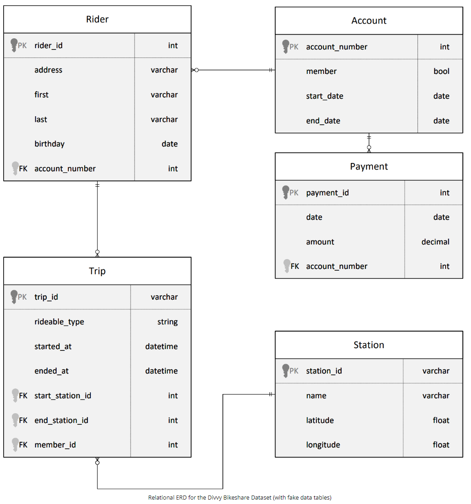
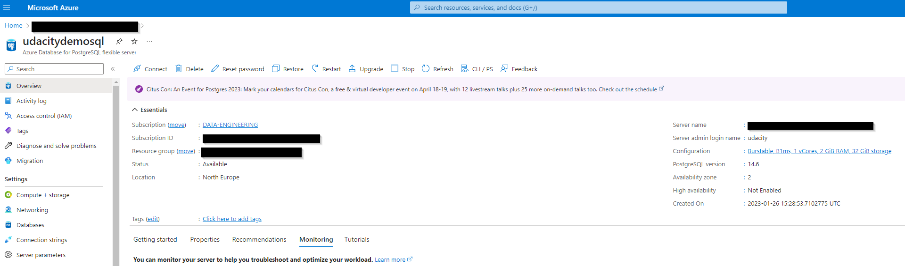
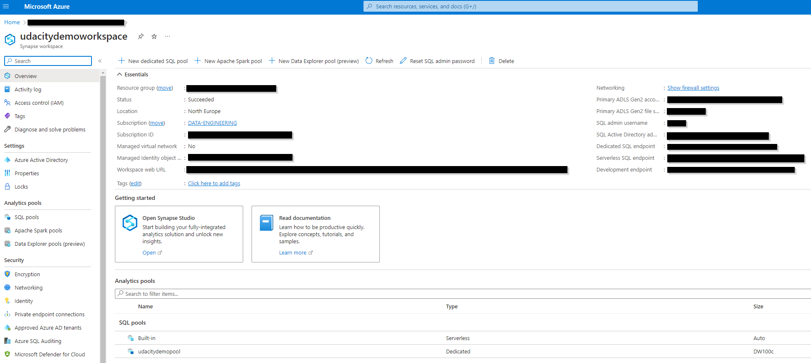
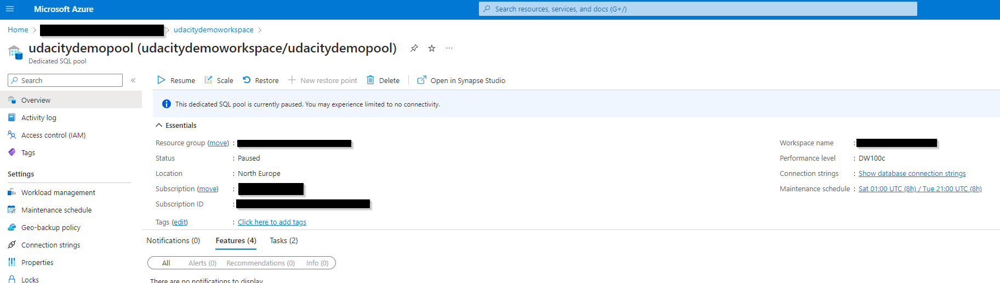
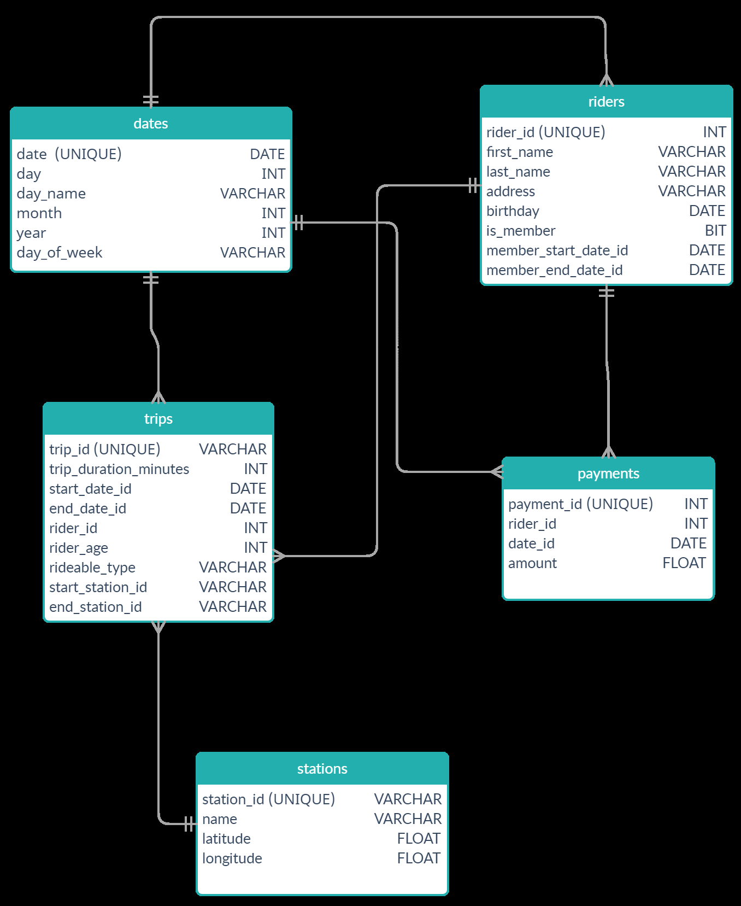
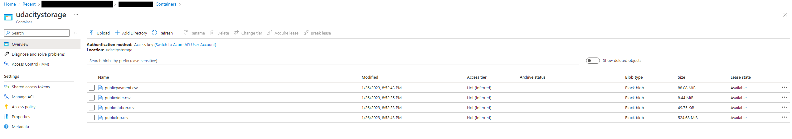
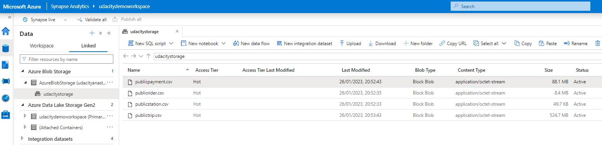
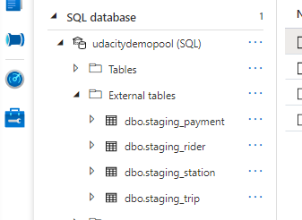
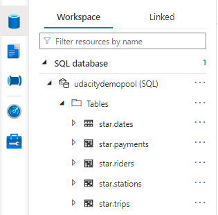

# Building-an-Azure-Data-Warehouse-for-Bike-Share-Data-Analytics
Udacity Nanodegree project: Building an Azure Data Warehouse for Bike Share Data Analytics

## Project Overview

Divvy is a bike sharing program in Chicago, Illinois USA that allows riders to purchase a pass at a kiosk or use a mobile application to unlock a bike at stations around the city and use the bike for a specified amount of time. The bikes can be returned to the same station or to another station. The City of Chicago makes the anonymized bike trip data publicly available for projects like this where we can analyze the data.

Since the data from Divvy are anonymous, we have created fake rider and account profiles along with fake payment data to go along with the data from Divvy. The dataset looks like this:

The goal of this project is to develop a data warehouse solution using Azure Synapse Analytics. You will:

Design a star schema based on the business outcomes listed below;
Import the data into Synapse;
Transform the data into the star schema;
and finally, view the reports from Analytics.

### The business outcomes you are designing for are as follows:

1. Analyze how much time is spent per ride
- Based on date and time factors such as day of week and time of day
- Based on which station is the starting and / or ending station
- Based on age of the rider at time of the ride
- Based on whether the rider is a member or a casual rider

2. Analyze how much money is spent
- Per month, quarter, year
- Per member, based on the age of the rider at account start

3. EXTRA CREDIT - Analyze how much money is spent per member
- Based on how many rides the rider averages per month
- Based on how many minutes the rider spends on a bike per month

## Task 1: Create your Azure resources
- Create an Azure PostgreSQL database

- Create an Azure Synapse workspace

- Use the built-in serverless SQL pool or dedicated pool and database within the Synapse workspace

## Task 2: Design a star schema
You are being provided a relational schema that describes the data as it exists in PostgreSQL. In addition, you have been given a set of business requirements related to the data warehouse. You are being asked to design a star schema using fact and dimension tables.

## Task 3: Create the data in PostgreSQL
To prepare your environment for this project, you first must create the data in PostgreSQL. This will simulate the production environment where the data is being used in the OLTP system. This can be done using the Python script provided for you in [Github: ProjectDataToPostgres.py](https://github.com/udacity/Azure-Data-Warehouse-Project/tree/main/starter)

1. Download the script file and place it in a folder where you can run a Python script
2. Download the data files from the classroom resources
3. Open the script file in VS Code and add the host, username, and password information for your PostgreSQL database
4. Run the script and verify that all four data files are copied/uploaded into PostgreSQL

You can verify this data exists by using pgAdmin or a similar PostgreSQL data tool.

## Task 4: EXTRACT the data from PostgreSQL
In your Azure Synapse workspace, you will use the ingest wizard to create a one-time pipeline that ingests the data from PostgreSQL into Azure Blob Storage. This will result in all four tables being represented as text files in Blob Storage, ready for loading into the data warehouse.

## Task 5: LOAD the data into external tables in the data warehouse
Once in Blob storage, the files will be shown in the data lake node in the Synapse Workspace. From here, you can use the script-generating function to load the data from blob storage into external staging tables in the data warehouse you created using the serverless SQL Pool.

## Task 6: TRANSFORM the data to the star schema
You will write SQL scripts to transform the data from the staging tables to the final star schema you designed.

### Helpful Hints
- When you use the ingest wizard, it uses the copy tool to EXTRACT into Blob storage. During this process, Azure Synapse automatically creates links for the data lake. When you start the SQL script wizard to LOAD data into external tables, start the wizard from the data lake node, not the blob storage node.
- When using the external table wizard, you may need to modify the script to put dates into a varchar field in staging rather than using the datetime data type. You can convert them during the transform step.
- When using the external table wizard, if you rename the columns in your script, it will help you when writing transform scripts. By default, they are named [C1], [C2], etc. which are not useful column names in staging.

Your submission will be assessed against this [rubric](https://review.udacity.com/#!/rubrics/4783/view)

### Business outcomes

1. Analyze how much time is spent per ride
- Based on date and time factors such as day of week and time of day
- Based on which station is the starting and / or ending station
- Based on age of the rider at time of the ride
- Based on whether the rider is a member or a casual rider

2. Analyze how much money is spent
- Per month, quarter, year
`SELECT 
  SUM(p.amount) total_amount,
  d.month,
  d.year
from [star].[payments] p
JOIN [star].[dates] d 
ON p.date_id = d.date
GROUP BY d.month, d.year`
- Per member, based on the age of the rider at account start
`SELECT 
  t.rider_id,
  t.rider_age,
  SUM(p.amount) as total_amount
FROM [star].[trips] t
JOIN [star].[payments] p 
ON t.start_date_id = p.date_id and t.rider_id = p.rider_id
GROUP BY t.rider_id, t.rider_age`

3. EXTRA CREDIT - Analyze how much money is spent per member
- Based on how many rides the rider averages per month
`SELECT 
  t.rider_id, 
  d.month,
  SUM(p.amount) as total_amount,
  COUNT(t.trip_id) as total_trips
  FROM [star].[trips] t
  JOIN [star].[dates] d
  ON t.start_date_id = d.date
  JOIN [star].[payments] p 
  ON t.start_date_id = p.date_id and t.rider_id = p.rider_id
   GROUP BY t.rider_id, d.month ORDER BY total_trips DESC`

- Based on how many minutes the rider spends on a bike per month
`SELECT 
  t.rider_id, 
  d.month,
  SUM(p.amount) as total_amount,
  SUM(t.trip_duration_minutes) as total_duration_of_trips_in_min
  FROM [star].[trips] t
  JOIN [star].[dates] d
  ON t.start_date_id = d.date
  JOIN [star].[payments] p 
  ON t.start_date_id = p.date_id and t.rider_id = p.rider_id
  GROUP BY t.rider_id, d.month ORDER BY total_duration_of_trips_in_min DESC`

